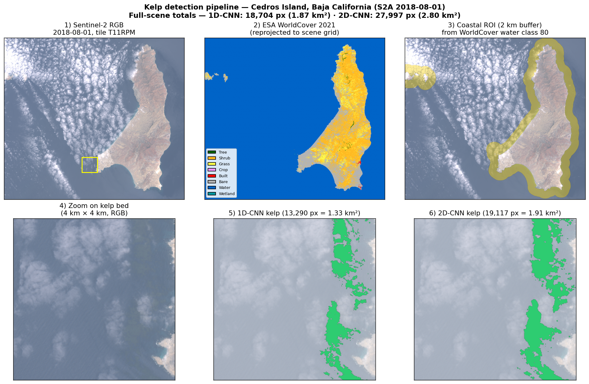
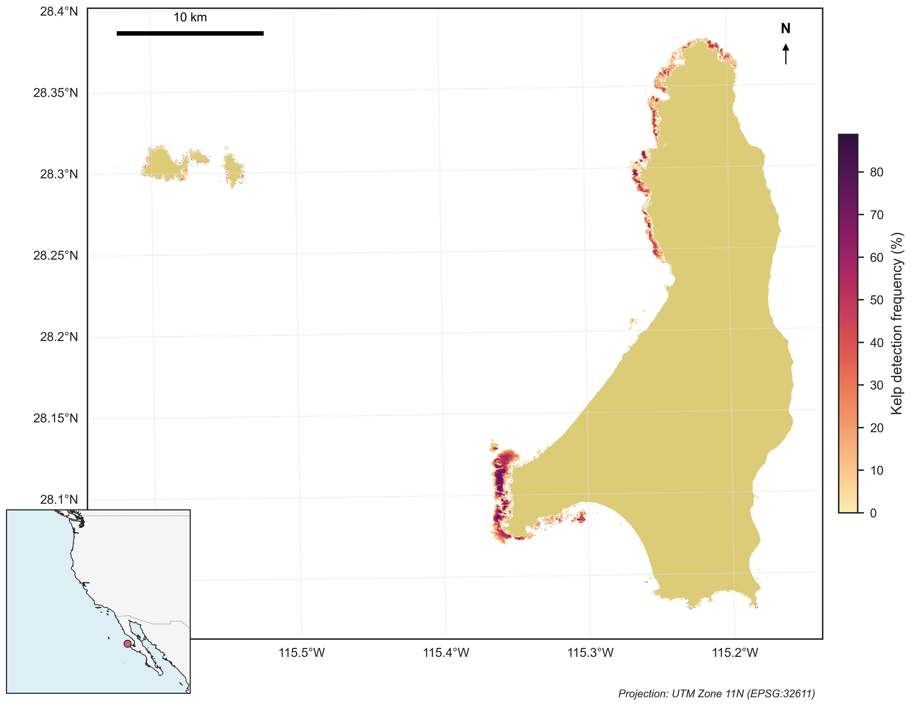

<h1 align="center">Kelp Detection - Sentinel-2</h1>

<p align="center">
<em>Binary CNN models for mapping giant kelp forests from Sentinel-2 satellite imagery</em>
</p>

<p align="center">
<a href="https://github.com/aquab1t/kelp-detection-sentinel2/blob/main/LICENSE">

</a>
<a href="https://www.python.org/">

</a>
<a href="https://github.com/aquab1t/kelp-detection-sentinel2/releases">

</a>


</p>

---

## Overview

This package detects giant kelp (*Macrocystis pyrifera*) from Sentinel-2 L1C satellite imagery using two lightweight CNN models trained for **binary kelp detection** (kelp vs not-kelp). Both models run on CPU via TensorFlow Lite - no GPU required.

**Key capabilities:**

- Works with **any Sentinel-2 L1C scene worldwide** - no scene-specific calibration
- **Two complementary models**: a fast pixel-wise 1D-CNN and a more accurate patch-based 2D-CNN
- **Binary output**: `uint8` GeoTIFF with `1`=kelp, `0`=everything else (including outside ROI)
- **Tunable threshold** (`--threshold`) lets you trade precision for recall without retraining
- **Automatic band resampling** (20 m → 10 m) handles mixed-resolution Sentinel-2 bands
- **Memory-efficient batch inference** for full-scene processing on modest hardware
- **ROI masking** from ESA WorldCover restricts inference to coastal kelp habitats

---

## Models

| | **1D-CNN Binary** | **2D-CNN Binary** |
|---|---|---|
| **Input** | Pixel spectrum (9 bands) | 11×11 spatial patch (9 bands) |
| **Output** | Kelp probability (sigmoid) | Kelp probability (sigmoid) |
| **Parameters** | ~30 K | ~112 K |
| **File size** | 54 KB (INT8) | 466 KB (INT8) |
| **Inference** | ~30 sec / tile | ~150 sec / tile |
| **Test accuracy** | 98.76% | 99.12% |
| **Kelp F1** | 0.985 | 0.982 |
| **Best for** | Rapid screening, time series | High-accuracy canopy mapping |

Both models use 9 Sentinel-2 MSI bands as input:

| Band | Wavelength | Native Resolution |
|------|-----------|-------------------|
| B02 | 490 nm (Blue) | 10 m |
| B03 | 560 nm (Green) | 10 m |
| B04 | 665 nm (Red) | 10 m |
| B05 | 705 nm (Red Edge 1) | 20 m |
| B06 | 740 nm (Red Edge 2) | 20 m |
| B07 | 783 nm (Red Edge 3) | 20 m |
| B08 | 842 nm (NIR) | 10 m |
| B8A | 865 nm (Narrow NIR) | 20 m |
| B11 | 1610 nm (SWIR 1) | 20 m |

The 20 m bands are automatically resampled to 10 m via bilinear interpolation during preprocessing.

---

## Installation

```bash
git clone https://github.com/aquab1t/kelp-detection-sentinel2.git
cd kelp-detection-sentinel2

pip install -r requirements.txt
pip install -e .
```

**Requirements:** `numpy`, `rasterio`, `scipy`, `joblib`, `tqdm`, `tflite-runtime` (or `ai-edge-litert`).

> The predictor auto-detects which TFLite runtime is available. On platforms where `tflite-runtime` is not published, install `ai-edge-litert` instead.

---

## Quick Start

### 1D-CNN - fast pixel-wise inference

```bash
python scripts/run_inference_1dcnn.py \
  --scene S2A_MSIL1C_20200101T180941_N0200_R084_T11RPM.SAFE \
  --output kelp.tif
```

### 2D-CNN - patch-based, higher accuracy

```bash
python scripts/run_inference_2dcnn.py \
  --scene S2A_MSIL1C_20200101T180941_N0200_R084_T11RPM.SAFE \
  --output kelp.tif
```

**Output:** `uint8` GeoTIFF with `1`=kelp, `0`=everything else.

### Using an ROI mask

Building an ROI mask from ESA WorldCover restricts inference to nearshore waters and dramatically reduces processing time:

```bash
python scripts/create_roi_mask.py \
  --worldcover ESA_WorldCover_10m_2021_v200.tif \
  --reference S2A_MSIL1C_20200101T180941_N0200_R084_T11RPM.SAFE \
  --output roi_mask.tif

python scripts/run_inference_2dcnn.py \
  --scene S2A_MSIL1C_20200101T180941_N0200_R084_T11RPM.SAFE \
  --output kelp.tif \
  --roi-mask roi_mask.tif
```

### Tuning the threshold

Both scripts accept `--threshold` (default `0.5`). Raise it to favour precision (fewer false kelp), lower it to favour recall (catch faint canopy):

```bash
python scripts/run_inference_2dcnn.py --scene ... --output kelp_strict.tif --threshold 0.7
```

---

## Python API

```python
from kelp_detection import Sentinel2Loader, Preprocessor, KelpPredictor

loader = Sentinel2Loader('S2A_MSIL1C_20200101T180941_N0200_R084_T11RPM.SAFE')
data = loader.load_bands()       # (9, H, W) float32
metadata = loader.get_metadata()

# 2D-CNN with ROI (the roi_mask kwarg avoids materialising 489 GiB of patches)
import rasterio, numpy as np
with rasterio.open('roi_mask.tif') as r:
    roi = r.read(1).astype(bool)

pre = Preprocessor(model_type='2dcnn')
X = pre.prepare_for_inference(data, roi_mask=roi)            # (n_roi_pixels, 11, 11, 9)

predictor = KelpPredictor('models/2dcnn_binary_int8.tflite')
y = predictor.predict_and_classify(X, threshold=0.5)         # uint8 {0,1}

# Fill back into a full-scene grid
flat = np.zeros(metadata['height'] * metadata['width'], dtype=np.uint8)
flat[roi.flatten()] = y
class_map = predictor.reshape_to_2d(flat, metadata['height'], metadata['width'])
predictor.export_geotiff(class_map, metadata, 'kelp.tif')
```

If you want raw probabilities (not thresholded), call `predictor.predict_binary(X)` instead - it returns sigmoid probabilities in `[0, 1]`.

---

## Worked Example - Cedros Island

The figure below walks through the full pipeline on `S2A_MSIL1C_20180801T181011_T11RPM` (Cedros Island, Baja California, 1 August 2018):



**Top row - building the ROI from external data:**

1. **Sentinel-2 RGB** of the source `.SAFE` scene, 2 % / 98 % stretch on B04/B03/B02. The yellow box marks the zoom region used in the bottom row.
2. **ESA WorldCover 2021 v200** reprojected to the Sentinel-2 grid. Class `80` (water, blue) is what `create_roi_mask.py` uses to find the coast. Other classes are listed in the inset legend; the destination buffer is initialised as water so the WorldCover tile boundary doesn't create a phantom land ring at the edge.
3. **Coastal ROI** - a 2 km Euclidean distance buffer around the water/land interface (yellow). Inference is restricted to these pixels; the rest of the scene is skipped, which keeps the 2D-CNN inside memory and cuts wall-clock by ~50× on a full tile.

**Bottom row - model outputs in the kelp-dense zoom (4 km × 4 km):**

4. **RGB zoom** showing the kelp bed in natural colour - visible as a faint brown/green slick in the surface water.
5. **1D-CNN binary kelp mask** overlaid in green. The pixel-wise model picks up the densest canopy core but tends to miss thin edges and isolated fronds.
6. **2D-CNN binary kelp mask** overlaid in green. The 11×11 patch model uses spatial context, so it labels more canopy edge and fills small gaps inside the bed.

For this scene, full-tile totals are **1.87 km² (1D-CNN)** vs **2.80 km² (2D-CNN)** - the 2D model recovers ~50 % more canopy because it can use texture and gradient cues, not just per-pixel spectra. Use the 1D-CNN for fast time-series screening, and the 2D-CNN when you need accurate canopy extent.

### Try it yourself - bundled example data

The repo ships with a 1024×1024 (≈10 km × 10 km) crop of the same scene around the kelp bed shown above, so you can reproduce the pipeline end-to-end without downloading a Sentinel-2 SAFE folder. Files live in `examples/`:

| File | Size | What it is |
|---|---|---|
| `cedros_2018-08-01_bands.tif` | 12 MB | Source 9-band uint16 GeoTIFF (`B02, B03, B04, B08, B05, B06, B07, B8A, B11`) |
| `cedros_worldcover.tif` | 15 KB | ESA WorldCover 2021 v200, reprojected to the scene grid |
| `cedros_roi.tif` | 28 KB | 2 km coastal-buffer ROI computed from WorldCover (precomputed) |
| `cedros_kelp_1dcnn.tif` | 10 KB | 1D-CNN inference output (precomputed reference) |
| `cedros_kelp_2dcnn.tif` | 10 KB | 2D-CNN inference output (precomputed reference) |
| `run_example.py` | – | Runs both models against the bundled bands.tif and writes the outputs |

To regenerate the kelp maps from scratch using the bundled bands and WorldCover:

```bash
git clone https://github.com/aquab1t/kelp-detection-sentinel2.git
cd kelp-detection-sentinel2
pip install -r requirements.txt
pip install -e .

python examples/run_example.py
```

Expected console output:

```
Loaded bands: shape=(9, 1024, 1024), dtype=float32, range=[1098, 5276]
ROI: 356,187 pixels in 2 km coastal buffer
Wrote cedros_roi.tif
1D-CNN: 14,774 kelp px = 1.48 km²
2D-CNN: 21,646 kelp px = 2.16 km²
Wrote cedros_kelp_1dcnn.tif and cedros_kelp_2dcnn.tif
```

The new GeoTIFFs should match the precomputed `cedros_kelp_{1,2}dcnn.tif` byte-for-byte. Open all three (`bands.tif`, `kelp_1dcnn.tif`, `kelp_2dcnn.tif`) in QGIS and stack them - the kelp pixels (value `1`) line up exactly with the canopy visible in the RGB.

The example script is also a self-contained reference for the API: 30 lines of code to load bands, build the ROI, run both models, and write GeoTIFFs.

### Multi-scene aggregation

When the pipeline is run across many dates and the binary maps stacked, you can compute per-pixel **detection frequency** - the fraction of cloud-free observations in which a pixel was labelled kelp. This is useful for distinguishing persistent canopy from transient artefacts:



Areas in dark purple were detected as kelp in >80 % of cloud-free scenes; pale yellow areas are sporadic detections that often correspond to drift kelp, glint, or single-scene noise. Stable beds tend to cluster on the western side of the island, in agreement with regional ecology surveys.

---

## Model Performance

### 1D-CNN Binary

Held-out test split (`SEED=42`, 15% of `ground_truth_cleaned.csv` = 10,227 samples):

| Metric | Not Kelp | Kelp |
|---|---|---|
| Precision | 0.9796 | 0.9998 |
| Recall | 0.9998 | 0.9698 |
| F1 | 0.9896 | **0.9845** |
| **Overall accuracy** | | **98.76%** |

> The 1D-CNN training set is split pixel-wise (random, stratified by class). Neighbouring pixels in the same scene have nearly identical spectra, so this number likely overstates real-world skill in unseen scenes. Treat it as an upper bound.

### 2D-CNN Binary

Held-out test patches (`patches_test_2dcnn.npz`, 7,200 samples - 1,800 kelp, 5,400 not-kelp):

| Metric | Not Kelp | Kelp |
|---|---|---|
| Precision | 0.9932 | 0.9855 |
| Recall | 0.9952 | 0.9794 |
| F1 | 0.9942 | **0.9824** |
| **Overall accuracy** | | **99.12%** |

See `models/README.md` for confusion matrices and architecture details, and `docs/METHODOLOGY.md` for the training methodology.

---

## Real-Scene Sanity Check

On `S2A_MSIL1C_20180801T181011_T11RPM` (Cedros Island, 2 km coastal-buffer ROI):

| Model | Kelp area | Notes |
|---|---|---|
| 1D-CNN | 1.87 km² | per-pixel, faster |
| 2D-CNN | 2.80 km² | spatial context picks up canopy edges |

Kelp is ~0.6% of ROI pixels - orders of magnitude rarer than in the training set (41% balanced). Real-world performance on novel scenes is therefore harder than the test-set numbers suggest.

---

## License

MIT - see [LICENSE](LICENSE).

---

## Acknowledgments

- Sentinel-2 data provided by ESA under the Copernicus programme
- ESA WorldCover 2021 v200 land-cover data for ROI masking
- Training site: Cedros Island, Baja California, Mexico
